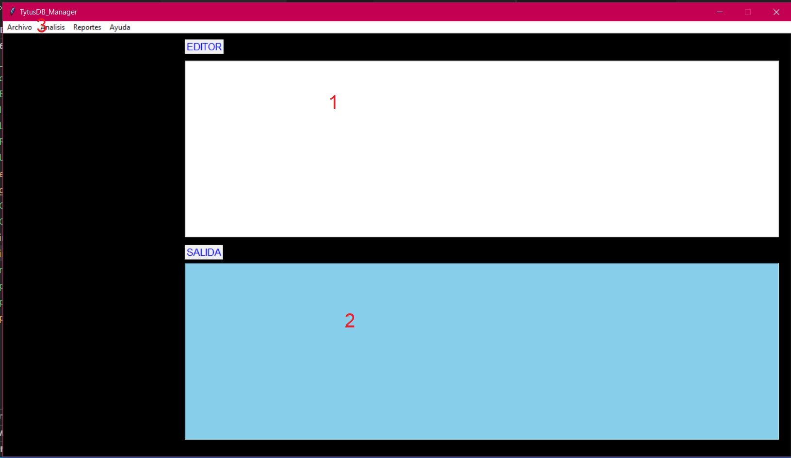
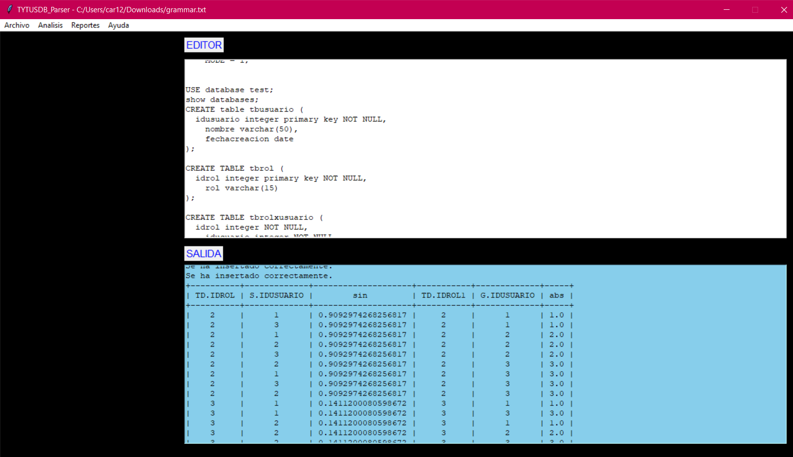
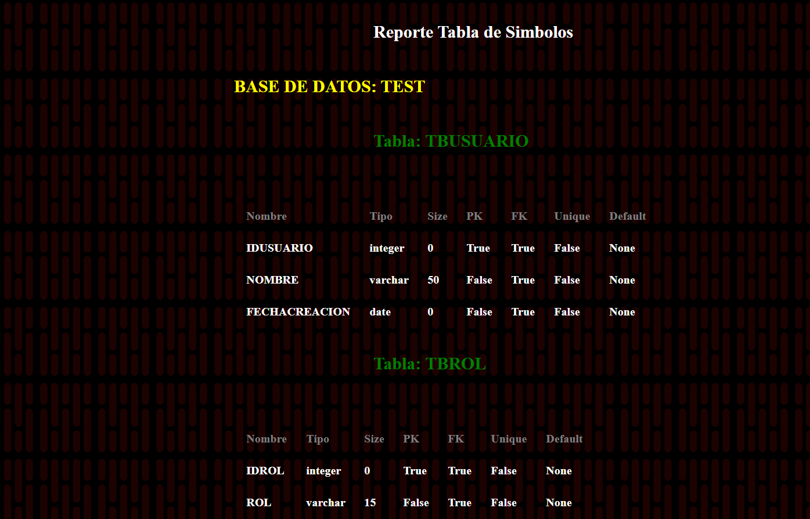
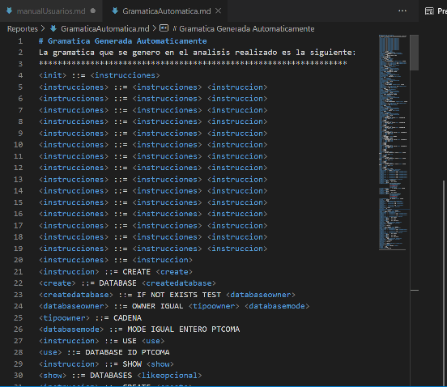

# Manual de Usuarios

## Contenido
* Introducción
* Funciones
* Aplicaciones
* Descripción

* Instrucciones de uso
* Ejemplos


## Introducción
El presente proyecto fue elaborado por el grupo 26. Por parte de la universidad de San Carlos de Guatemala, de la Facultad de Ingeniería. Elaborado en el curso de vacaciones de diciembre 2020. Del curso de Organización de Lenguajes y Compiladores 2.

Es un proyecto real de código abierto, elaborado en equipos de trabajo. En el cual se creó un intérprete para el subconjunto del lenguaje SQL, utilizando para su desarrollo la traducción dirigida por la sintaxis. Utilizando para su construcción el lenguaje de programación PYTHON y la herramienta de análisis léxico y sintáctico PLY.

El proyecto consta de tres herramientas para su utilización las cuales son el SQL Parser, un Type Checker y un Query Tool. Pudiento analizar la entrada SQL ingresada, invocar las funciones solicitadas, manipular el resultado de las funciones, proporcionar la función parser y devolver un detalle de la información.

Además el sistema consta de un módulo de reportes, en donde se tienen un reporte de errores léxicos, sintácticos y semánticos. Un reporte de gramática, un reporte de tabla de símbolos y un reporte de AST.

## Funciones
El proyecto elaborado consta de las siguientes funciones:
* Analizar las instrucciones escritas
* Abrir y leer archivos
* Tener una interfaz para el manejo del programa
* Contar con una consola de entrada donde se puede editar el código SQL a interpretar
* Contar con una consola de salida para ver el resultado de las salidas
* Hacer un analisis léxico de las instrucciones SQL ingresadas
* Hacer un análisis sintáctico de las instrucciones SQL ingresadas
* Hacer un análisis semántico de las instrucciones SQL ingresada
* Crear un reporte de errores léxicos, sintácticos y semánticos
* Crear un reporte de la tabla de símbolos
* Generar un AST
* Crear un reporte del AST generado
* Crear un reporte de la gramática utilizada en las instrucciones SQL ingresadas, creado automáticamente
* Realizar las funciones SQL ingresadas.

## Aplicaciones
Las aplicaciones que se le pueden dar al presente proyecto son implementar un motor de una base de datos sencillo y ligero. El cual es capaz de reconocer la estructura sintáctica, léxica y semántica, de las instrucciones ingresadas, además de interpretar las funciones ingresadas.

## Descripción
El proyecto elaborado en python como lenguaje de programación y utilizando PLY como herramienta para el análisis léxico y sintáctico.

La primer herramienta el SQL Parser es el interprete encargado de analizar las sentencias SQL las cuales proporcionan una función para invocar al parser, al recibir una consulta el parser luego del proceso interno y de la planificación de la consulta debe invocar las diferentes funciones proporcionadas por el componente de administrador de almacenamiento.

La segunda herramienta el type checker es un sub componente que ayudará al parser a la comprobación de tipos. Al crear un objeto cualquiera se debe crear una estructura que almacenará los tipos de datos y cualquier información necesaria para este fin.

Y la tercer herramienta es el Query Tool es un sub componente que consiste en una ventana gráfica similar al Query Tool de pgadmin de PostgreSQL, para ingresar consultas y mostrar los resultados, incluyendo el resalto de la sintaxis. La ejecución se realizará de todo el contenido del área de texto.

## Instrucciones de Uso
Al iniciar la aplicación esta cuenta con la siguiente interfaz:



El punto número 1, es la consola de entrada en donde se pueden cargar los archivos de entrada, y editar estos, además de escribir el código que se desee en esta. Es a partir de esta entrada, que se analizará el texto y las instrucciones SQL de estas.

El punto número 2, es la consola de salida, en donde se mostrará el resultado de la entrada.

El punto número 3, es la barra de menú las cual cuenta con los botones, con los cuales se pueden realizar las diferentes acciones deseadas, los botones se distribuyen de la siguiente manera:
* Archivo
    * Abrir: Con este botón se puede abrir un archivo con extensión .txt que tenga código SQL a analizar.
    * Guardar: Con este se puede guardar un archivo con, tomando la entrada de la interfaz, como el texto a guardar.
* Analisis
    * Ejecutar Analisis: En este botón se ejecutan todas las funciones, tanto para el análisis, como la interpretación y la elaboración de los reportes solicitados.
* Reporte
    * Reporte Errores: Abre el reporte de errores léxicos, sintácticos y semánticos.
    * Tabla de Símbolos: Abre el reporte de la tabla de símbolos.
    * Reporte AST: Abre el reporte del AST.
    * Reporte Gramatical: Abre el reporte de la gramática generada automáticamente.
* Ayuda
    * Manuales: Abre los manuales, el técnico y el de usuario.

## Ejemplos

El primer ejemplo muestra la interfaz con instrucciones SQL escritas en la consola de entrada, y el resultado de estas en la consola de salida.



El segundo ejemplo es una imagen del reporte del AST generado del analisis de la imagen previa.


El tercer ejemplo es una imagen del reporte de la tabla de simbolos generada:



El cuarto ejemplo es una imagen del reporte de la gramática generado automáticamente:



## El codigo SQL utilizado en los ejemplos anteriores es:
``` sql
CREATE DATABASE IF NOT EXISTS test
    OWNER = 'root'
    MODE = 1;


USE database test;
show databases;
CREATE table tbusuario (
  idusuario integer primary key NOT NULL,
    nombre varchar(50),
    fechacreacion date
);

CREATE TABLE tbrol (
  idrol integer primary key NOT NULL,
    rol varchar(15)
);

CREATE TABLE tbrolxusuario (
  idrol integer NOT NULL,
    idusuario integer NOT NULL
);


insert into tbrol values (1,'Administrador');
insert into tbrol values (2,'Secretaria');
insert into tbrol values (3,'Ventas');
--insert into tbrole values (1,'root');

insert into tbusuario values(1, md5('Luis Fernando'), now());
insert into tbusuario values(2,'Maria Cristina', '2020/02/08');
insert into tbusuario values(3,'Hugo Alberto', '2020/02/08');

insert into tbrolxusuario values(1,1);
insert into tbrolxusuario values(2,2);
insert into tbrolxusuario values(2,3);

/*
select E.idrol, tbusuario.nombre, tbrolxusuario.*
from tbrolxusuario, tbrol E, tbusuario
where tbrol.idrol = tbrolxusuario.idrol
or tbusuario.idusuario = tbrolxusuario.idusuario;
*/

select distinct td.idrol, s.idusuario, sin(td.idrol), td.idrol, g.idusuario, abs(g.idusuario)
from tbrol td, tbusuario s, (select f.idusuario, f.nombre, f.fechacreacion from tbusuario f) r, (select f.idusuario, f.nombre, f.fechacreacion from tbusuario f) g
where idrol > 1;
```

## Ejemplo de salida en tres direcciones

```py
#imports
import sys
sys.path.append('../G26/Librerias/goto')

from goto import *
import gramatica as g
import Utils.Lista as l
import Librerias.storageManager.jsonMode as storage
import Instrucciones.DML.select as select
from Error import *

#storage.dropAll()

heap = []
semerrors = []

datos = l.Lista({}, '')
l.readData(datos)

#funcion intermedia
def mediador(value):
    global heap
    global semerrors
   # Analisis sintactico
    instrucciones = g.parse(heap.pop())
    for instr in instrucciones['ast'] :

        try:
            val = instr.execute(datos)
        except:
            val = (instr.execute(datos, {}))

        if isinstance(val, Error):
            'error sem�ntico'
            print(val)
            semerrors.append(val)
        elif isinstance(instr, select.Select) :
            
            if value == 0:
                try:
                    print(val)
                    if len(val.keys()) > 1 :
                        print('El numero de columnas retornadas es mayor a 1')
                        return 0
                    for key in val:
                        if len(val[key]['columnas']) > 1 :
                            print('El numero de filas retornadas es mayor a 1')
                        else :
                            return val[key]['columnas'][0][0]
                        break
                except:
                    return 0
            else:
                print(instr.ImprimirTabla(val))
        else :
            try:
                return val.val
            except:
                print(val)

    l.writeData(datos)

#funciones de plg-sql

@with_goto
def ValidaRegistros():
    tabla = heap.pop()
    cantidad = heap.pop()
    resultado =  0
    retorna =  0

    t16 = tabla == 'tbProducto'
    if (t16):   goto .t21  
    goto .t22
    label .t21
    valSelectPrint = 0
    t17 = 'SELECT  COUNT(*)    FROM tbProducto   ; '
    heap.append(t17)
    t17 = mediador(valSelectPrint)
    resultado = t17

    t18 = cantidad == resultado
    if (t18):   goto .t19  
    goto .t20
    label .t19
    retorna = 1

    goto .if0
    label .t20
    retorna = 0


    label .if0
    goto .if1
    label .t22

    label .if1
    t23 = tabla == 'tbProductoUp'
    if (t23):   goto .t29  
    goto .t30
    label .t29
    valSelectPrint = 0
    t25 = 'SELECT  COUNT(*)    FROM tbProducto    WHERE estado = 2; '
    heap.append(t25)
    t25 = mediador(valSelectPrint)
    resultado = t25

    t26 = cantidad == resultado
    if (t26):   goto .t27  
    goto .t28
    label .t27
    retorna = 1

    goto .if2
    label .t28
    retorna = 0


    label .if2
    goto .if3
    label .t30

    label .if3
    t31 = tabla == 'tbbodega'
    if (t31):   goto .t36  
    goto .t37
    label .t36
    valSelectPrint = 0
    t32 = 'SELECT  COUNT(*)    FROM tbbodega   ; '
    heap.append(t32)
    t32 = mediador(valSelectPrint)
    resultado = t32

    t33 = cantidad == resultado
    if (t33):   goto .t34  
    goto .t35
    label .t34
    retorna = 1

    goto .if4
    label .t35
    retorna = 0


    label .if4
    goto .if5
    label .t37

    label .if5
    heap.append(retorna)
    return 

@with_goto
def CALCULOS():
    hora =  0
    SENO =  0
    VALOR =  0
    ABSOLUTO =  0

    valSelectPrint = 0
    t44 = 'SELECT EXTRACT( HOUR FROM TIMESTAMP \'2001-02-16 20:38:40\')   ; '
    heap.append(t44)
    t44 = mediador(valSelectPrint)
    hora = t44

    valSelectPrint = 0
    t45 = 'SELECT SIN(1)   ; '
    heap.append(t45)
    t45 = mediador(valSelectPrint)
    SENO = t45

    t47 = ' TRUNC(SENO * hora)'
    heap.append(t47)
    t47 = mediador(0)
    VALOR = t47

    t49 = 'LENGTH(SUBSTRING(\'FASE2\', 1, 4))'
    heap.append(t49)
    t49 = mediador(0)
    t50 = VALOR + t49
    VALOR = t50

    t53 = ' ABS(SINH(- 1))'
    heap.append(t53)
    t53 = mediador(0)
    ABSOLUTO = t53

    t54 = ' SQRT(225)'
    heap.append(t54)
    t54 = mediador(0)
    t55 = ABSOLUTO * t54
    ABSOLUTO = t55

    t56 = VALOR + ABSOLUTO
    t57 = 'ACOSD(0.5)'
    heap.append(t57)
    t57 = mediador(0)
    t58 = t56 / t57
    VALOR = t58

    t59 = VALOR > 1
    if (t59):   goto .t60  
    goto .t61
    label .t60
    VALOR = 20

    goto .if6
    label .t61
    VALOR = 10


    label .if6
    heap.append(VALOR)
    return 

@with_goto
def sp_validainsert():
    t66 = 'insert INTO tbbodega VALUES ( 1 ,  \'BODEGA CENTRAL\' , 1 ) ;' 
    heap.append(t66)
    mediador(0)

    t67 = 'insert INTO tbbodega VALUES ( 2 ,  \'BODEGA ZONA 12\' ) ;' 
    heap.append(t67)
    mediador(0)

    t68 = 'insert INTO tbbodega VALUES ( 3 ,  \'BODEGA ZONA 11\' , 1 ) ;' 
    heap.append(t68)
    mediador(0)

    t69 = 'insert INTO tbbodega VALUES ( 4 ,  \'BODEGA ZONA 1\' , 1 ) ;' 
    heap.append(t69)
    mediador(0)

    t70 = 'insert INTO tbbodega VALUES ( 5 ,  \'BODEGA ZONA 10\' , 1 ) ;' 
    heap.append(t70)
    mediador(0)


#main
@with_goto
def main():
    global heap
    t0 = 'drop procedure g26;' 
    heap.append(t0)
    mediador(0)

#Ejecucion del main
if __name__ == "__main__":
    main()

```
