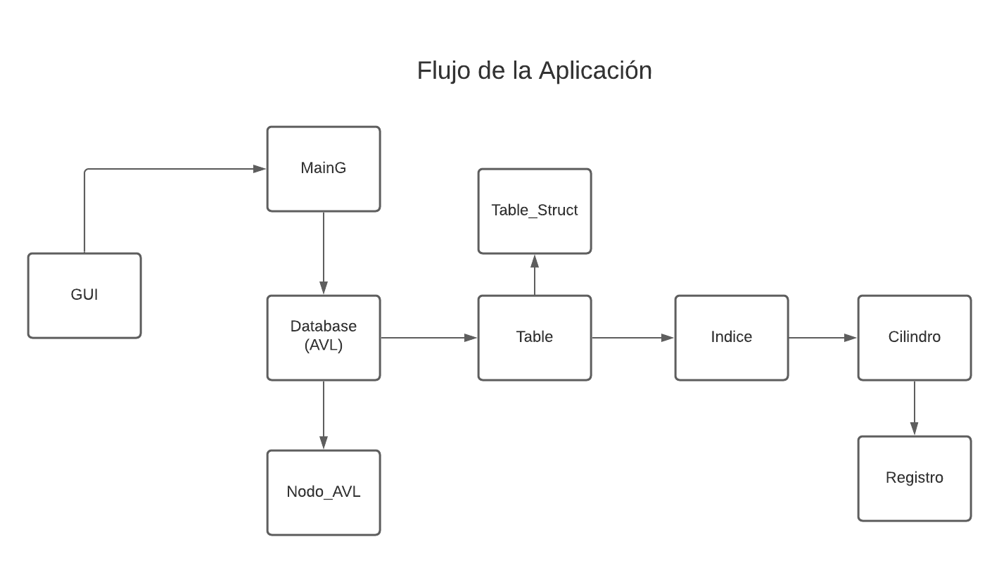
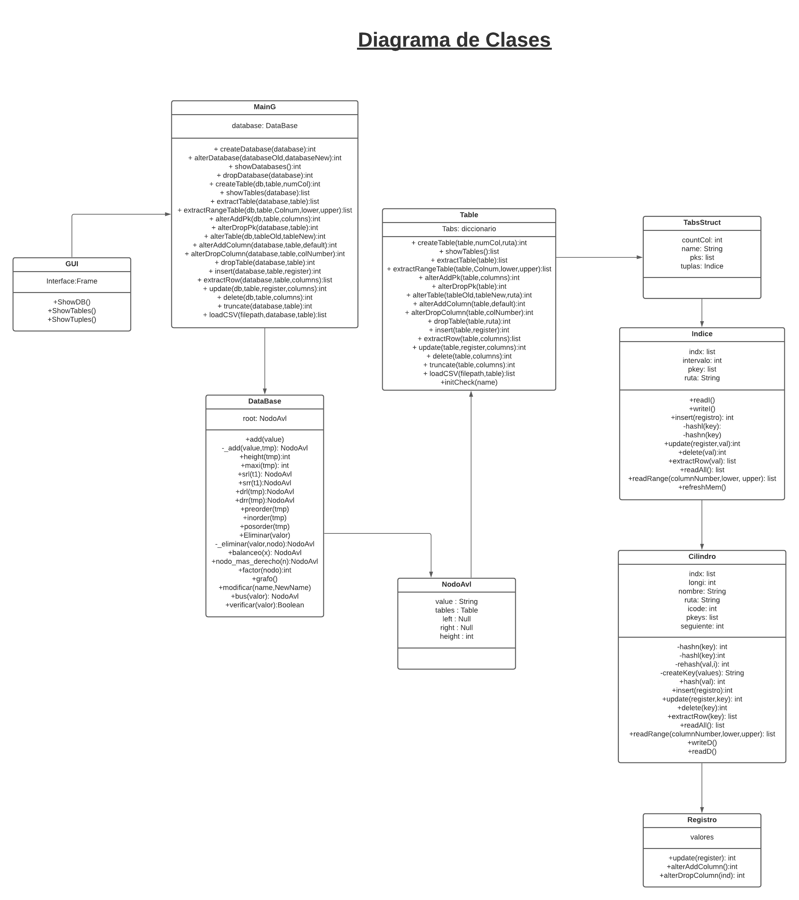

# Manual de Tecnico EDD_Grupo 9

Diseño, desarrollo e implementacion de software para el manejo de bases de datos e informacion de la Universidad de San Carlos de Guatemala, grupo 9 del curso estructuras de datos.

## Introducción
    * Nota: El contenido del manual técnico da por hecho que el usuario tiene los conocimientos basicos de informatica.
La universidad de San Carlos de Guatemala se dispone junto con los colaboradores correspondientes a los cursos de Bases de Datos, Compiladores 2 y Estructuras de Datos, a realizar un software de codigo abierto para el manejo de informacion por medio de estructuras relacionales llamado Tytus. Dicho software tiene como proposito poner a disposicion una aplicacion simple pero poderosa para el manejo de bases de datos, por lo cual se detalla el desarrollo del software.

## Objetivos
* #### General
Informar y especificar al usuario sobre la estructura y funcionamiento del software presentado con el fin de poder realizar soporte, modificaciones y asi actualizar el sistema.

* #### Especificos
    * Conocer las estructuras utilizadas en el desarrollo del proyecto.
    * Conocer el funcionamiento y el flujo que las bases de datos, tablas y tuplas continen.
	* Conocer la encriptación y desencriptación de valores
	* Conocer la codificación de datos a utf-8, ascii e iso-8859-1
	* Conocer la funcionalidad del blockchain 
## Alcance
El documento será elaborado para las personas con conocimiento en desarrollo de software, orientado a guiar el proceso de dar soporte a la estructura de datos.

## Modulos 

#### Gui
En este modulo los usuarios podran realizar las funciones que Tytus db ofrece, de una manera grafica para ser mas accesible y entendible para cualquier usuario que desee utilizar nuestro gestor de bases de datos. Cuenta con diferentes ventanas para la navegabilidad. Cuenta con lector de archivos CSV para agilizar la carga de datos a las bases de datos creadas.

#### Mode
En la carpeta data se encontraran todas las estructuras de datos que Tytus db tiene para su implementación, con la finalidad de que sea más flexible a la hora de almacenar datos, ya que se posee con estructuras como Tabla Hash, Arbol Avl, Arbol B, Arbol B+, ISAM, Diccionario y Json.
En cualquiera de estos archivos podremos instanciar para almacenar nuestras bases de datos y ser utilizadas si problemas.

#### Bases de Datos
Este modulo contiene toda la estructura del gestor Tytus, porque contiene la instancia de las tablas y basandonos en un estructura jerarquica conseguimos que las tablas contencan la instancia de cualquiera de las estructuras antes mencionadas, en estos modulos no solo se cuenta con las funciones para gestionar la base de datos sino que tambien su encriptación, su compresión, su cifrado, entre otras.

#### Tablas
Para este modulo se penso en un diccionario, los cuales proporciona Python, porque es una estructura facil y muy potente que podemos utilizar y aprobechar de una manera muy optima, ya que al momento de acceder a los datos es de manera O(1) por el hecho de manejar sus datos con indices. Para conseguir esto utilizamos una clase la cual contendra los valores necesarios y que accedemos con frecuencia como lo son las llaves primarias, el nombre de la tabla, el numero de columnas de dicha tabla y lo mas importante la instancia hacia las tuplas (ISAM), para poder acceder a sus metodos de nivel tupla.


## Contenido Tecnico Del Sistema

### Diagrama Conceptual


### Diagrama de Clases


## Requerimientos Del Sistema
El software Tytus es una aplicacion de bases de datos que usa tecnologias diferentes para sus diferentes modulos asi:
    * Estructuras de Datos: Tecnología basada en el lenguaje de programacion Python 
    * Graficar: Tecnología basada en Graphviz

## Configuracion De La Aplicación

Para poder utilizar la aplicacion es necesario importar el archivo llamado MainG para ello es necesario implementar la siguiente linea de codigo:

```python
	from team09 import mainG
```
Despues de haber incluido la linea de codigo podremos darle un seudonimo a la importacion para hacerlo mas facil de manejar por ejemplo podriamos llamarlo con la letra i 

```python
	from team09 import mainG as j
```
Con esto nos facilitamos el uso de la importacion, despues de haberlo hecho ya podremos utilizar todas las funciones que Tytus Db ofrece. 

